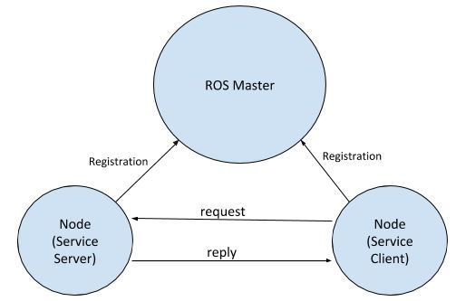
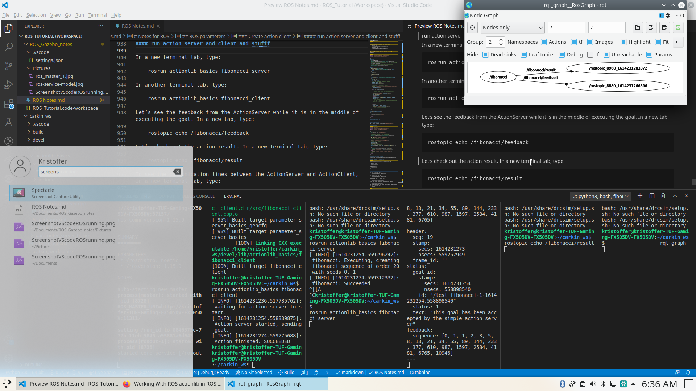

# Notes for ROS

Guides used is

    https://automaticaddison.com/ros-noetic-ninjemys-basics-part-1-of-2/

- [Notes for ROS](#notes-for-ros)
	- [ALL ros packages](#all-ros-packages)
	- [general Commands](#general-commands)
		- [create new packages and building](#create-new-packages-and-building)
		- [Dependencies](#dependencies)
	- [Nodes](#nodes)
		- [A publisher node](#a-publisher-node)
			- [cpp publisher nodes](#cpp-publisher-nodes)
				- [python publisher nodes](#python-publisher-nodes)
		- [Subscriber nodes](#subscriber-nodes)
			- [CPP Subscriber nodes](#cpp-subscriber-nodes)
				- [headers](#headers)
				- [callback function](#callback-function)
				- [Main method](#main-method)
					- [spin](#spin)
			- [python subscriber nodes](#python-subscriber-nodes)
		- [Adding node](#adding-node)
			- [CPP](#cpp)
				- [Compiling](#compiling)
			- [python](#python)
		- [Node Commands](#node-commands)
			- [usefull commands](#usefull-commands)
			- [graph relationships](#graph-relationships)
			- [Example of stuff running](#example-of-stuff-running)
		- [Custom messages](#custom-messages)
		- [Create custom subscriber and publisher Nodes](#create-custom-subscriber-and-publisher-nodes)
			- [custom piblusher node cpp](#custom-piblusher-node-cpp)
			- [custum subscriber node CPP](#custum-subscriber-node-cpp)
			- [add executable to CMakeList](#add-executable-to-cmakelist)
			- [custom publisher node Python (WP)](#custom-publisher-node-python-wp)
			- [custom subscriber node Python  (WP)](#custom-subscriber-node-python--wp)
		- [Create ROS service in CPP](#create-ros-service-in-cpp)
			- [CPP Server](#cpp-server)
			- [CPP Client](#cpp-client)
				- [add CMakeLists.txt exeecution](#add-cmakeliststxt-exeecution)
		- [Launch File CPP](#launch-file-cpp)
		- [Launch File Python](#launch-file-python)
		- [launch file executions](#launch-file-executions)
	- [ROS parameters](#ros-parameters)
		- [Dynamically set and get by](#dynamically-set-and-get-by)
		- [dynamic_reconfigure Package](#dynamic_reconfigure-package)
			- [.cfg Python](#cfg-python)
			- [change permisions](#change-permisions)
			- [change CMakeLists.txt](#change-cmakeliststxt)
			- [cfg CCP](#cfg-ccp)
				- [add executable to cmake](#add-executable-to-cmake)
		- [Action lib](#action-lib)
			- [craete action server](#craete-action-server)
			- [check action list with](#check-action-list-with)
		- [Create action client](#create-action-client)
			- [code example](#code-example)
			- [other resources for actionlib](#other-resources-for-actionlib)
			- [add executable to CMakeLists.txt](#add-executable-to-cmakeliststxt)
			- [run action server and client and stufff](#run-action-server-and-client-and-stufff)
			- [screenshot of it working](#screenshot-of-it-working)
		- [actionlib with python](#actionlib-with-python)
			- [change mod](#change-mod)
	- [PLUGIN time](#plugin-time)
		- [cpp exmapke code](#cpp-exmapke-code)
			- [[plugin base].h example](#plugin-baseh-example)
			- [[plugin connect].h example](#plugin-connecth-example)
			- [add cpp files](#add-cpp-files)
			- [add to CMakeLists.txt](#add-to-cmakeliststxt)
			- [Compile](#compile)
			- [make available to ROS](#make-available-to-ros)
			- [create loader file cpp](#create-loader-file-cpp)
			- [add following to package CMakeLists.txt](#add-following-to-package-cmakeliststxt)
			- [quick test pluginrosrun pluginlib_tutorials_ polygon_loader](#quick-test-pluginrosrun-pluginlib_tutorials_-polygon_loader)
			- [nodelets](#nodelets)
		- [add to package.xml](#add-to-packagexml)
		- [add to cmake.](#add-to-cmake)
		- [test with catkin_make](#test-with-catkin_make)
		- [make launch dir](#make-launch-dir)
		- [launch ros](#launch-ros)
			- [puslishing and reading messages](#puslishing-and-reading-messages)
			- [check on graph](#check-on-graph)

## ALL ros packages

    https://index.ros.org/packages/

## general Commands

    rospack find [package_name]
    rosls turtlesim
    rospack list-names
    roscd turtlesim & pwd

### create new packages and building

    catkin_create_pkg <package_name> [depend1] [depend2] [depend3]
    catkin_make

### Dependencies

    rosdep update
    rospack depends [name of package]

## Nodes


### A publisher node

    also ROS Master

is a program that publishes data (e.g. a sensor reading on a robot). A subscriber node is a program that subscribes to published data. Nodes communicate with each other by passing messages (i.e. publishing data and subscribing to that data) via named topics. You can also have nodes that both publish data and subscribe to data. ("https://automaticaddison.com/how-to-create-a-publisher-node-in-ros-noetic/")

#### cpp publisher nodes

```cpp
    #include "ros/ros.h"  
    #include "std_msgs/String.h" 
    #include <sstream> 
    int main(int argc, char **argv) {
        ros::init(argc, argv, "simple_publisher_node");
        ros::NodeHandle n;
        ros::Publisher pub = n.advertise<std_msgs::String>("message", 1000);
        ros::Rate loop_rate(10);
        int count = 0;
    
        while (ros::ok()) {
            std_msgs::String msg;
            std::stringstream ss;
            ss << "Hello Automatic Addison! " << count;
            msg.data = ss.str();
            ROS_INFO("%s", msg.data.c_str());
            pub.publish(msg);
            ros::spinOnce();    
            loop_rate.sleep();
            ++count;
        } return 0; }
```

##### python publisher nodes

```python
#!/usr/bin/env python3
import rospy
from std_msgs.msg import String
def publish_message():
    pub = rospy.Publisher('message_py', String, queue_size=10)
    rospy.init_node('simple_python_publisher', anonymous=True)
    rate = rospy.Rate(10) # 10hz
    
    while not rospy.is_shutdown():
        hello_str = "Hello Automatic Addison! %s" % rospy.get_time()
        rospy.loginfo(hello_str)
        pub.publish(hello_str)
        rate.sleep()
if __name__ == '__main__':
    try:
        publish_message()
    except rospy.ROSInterruptException:
        pass
```

### Subscriber nodes

#### CPP Subscriber nodes

##### headers

Subscripes to the master node much like a youtube subscriber that recieves information

```cpp
#include "ros/ros.h"
```

need to include. The syntax is `#include <package_name/type_name.h>`
Here we want to subscribe to messages of type String that are owned by the std_msgs package (<http://wiki.ros.org/std_msgs>)

```cpp
#include "std_msgs/String.h"
```

##### callback function

A program that subscribes to
to a topic (i.e. subscriber node) doesn't know when messages will be  arriving. If you have code that needs to process an incoming message (e.g. most often sensor data in robotics)
The syntax for a subscriber callback function is

```cpp
void function_name(const package_name::type_name &msg) { 
        [insert your code here] }
```

The function below is executed each time a new message arrives.

    Topic Name: /message
    Message Type: std_msgs/String

```cpp
void messageCallback(const std_msgs::String::ConstPtr& msg) {     
//Display the message that was received to the terminal window
ROS_INFO("The message I received was: [%s]", msg->data.c_str()); }
```

##### Main method

```cpp
int main(int argc, char **argv) {
ros::Subscriber sub = node_handle.subscribe(
topic_name_without_leading_slash,
queue_size, callback_function);
```

Initialize the node and set the name with `ros::init()` function needs to see argc and argv.

The third argument is the name of the node.

```cpp
ros::init(argc, argv, "simple_subscriber_node");  
```

create the main access point for the node

This piece of code enables the node to communicate with the ROS system.

```cpp
ros::NodeHandle n;  
```

###### spin

```cpp
ros::spinOnce() // since that gives you more control when you want the node
    
ros::spin() // you want ROS to wait for messages and return 0;
```

#### python subscriber nodes

```python
#!/usr/bin/env python3

import rospy
from std_msgs.msg import String

def callback(data):
    rospy.loginfo(rospy.get_caller_id() + "I heard %s", data.data)
 
def receive_message():
    rospy.init_node('simple_python_subscriber', anonymous=True)
    rospy.Subscriber("message_py", String, callback)
    rospy.spin()
if __name__ == '__main__':
    receive_message()
```

### Adding node

#### CPP

##### Compiling

add these lines to the bottom of the CMakeLists.txt file:

```CMake
add_executable(simple_publisher_node src/simple_publisher_node.cpp)
target_link_libraries(simple_publisher_node ${catkin_LIBRARIES})

add_executable(simple_subscriber_node src/simple_subscriber_node.cpp)
target_link_libraries(simple_subscriber_node ${catkin_LIBRARIES})
```

then navigate to root

    catkin_make 

#### python

navigate to

    roscd noetic_basics_part_1/scripts

make these executable

    chmod +x simple_python_publisher.py
    chmod +x simple_python_subscriber.py

Then in root folder

    catkin_make 

### Node Commands

for starting the ROS master

    roscore

Then

    for CPP
        rosrun noetic_basics_part_1 simple_publisher_node
        rosrun noetic_basics_part_1 simple_subscriber_node

    for python
        rosrun noetic_basics_part_1 simple_python_publisher.py
        rosrun noetic_basics_part_1 simple_python_subscriber.py

syntax:

    rosrun package-name executable-name

#### usefull commands

    roscore
    rosnode list
    rosnode info /simple_publisher_node
    rostopic info message
    rostopic type /message
    rostopic bw /message

#### graph relationships

use command (i havent make it work yet)

    rqt graph

#### Example of stuff running


### Custom messages

go to

    roscd [working_project]/msg
    code noetic_basics_part_1_msg.msg

add

    fieldtype fieldname
        int32 A
        int32 B
        int32 C

open package.xml in roscd [working project]

```xml
<build_depend>message_generation</build_depend>
<exec_depend>message_runtime</exec_depend>
```

go to CMakeList.txt and add

```CMake
find_package(catkin REQUIRED COMPONENTS
roscpp
std_msgs
message_generation)
```

```CMake
add_message_files(
FILES
Message1.msg
Message2.msg )
```

```CMake
generate_messages(
DEPENDENCIES
std_msgs )
```

then in root project

    catkin_make

Check with

    rosmsg package noetic_basics_part_1

### Create custom subscriber and publisher Nodes

#### custom piblusher node cpp

```cpp
#include "ros/ros.h"
#include "noetic_basics_part_1/noetic_basics_part_1_msg.h"
#include <sstream>
 
int main(int argc, char **argv) {
ros::init(argc, argv, "simple_publisher_node_custom_msgs");
ros::NodeHandle n;
ros::Publisher pub = n.advertise<noetic_basics_part_1::noetic_basics_part_1_msg>("noetic_basics_part_1/message", 1000);
ros::Rate loop_rate(10);
while (ros::ok()) {
    noetic_basics_part_1::noetic_basics_part_1_msg msg;
    msg.A = 1;
    msg.B = 2;
    msg.C = 3;

    pub.publish(msg);
    ros::spinOnce();

    loop_rate.sleep(); }

return 0; }
```

#### custum subscriber node CPP

```cpp
#include "ros/ros.h"
#include "noetic_basics_part_1/noetic_basics_part_1_msg.h"
 
void messageCallback(const noetic_basics_part_1::noetic_basics_part_1_msg::ConstPtr& msg) {
    ROS_INFO("I have received: [%d] [%d] [%d]", msg->A, msg->B, msg->C); }
 
int main(int argc, char **argv) {
    ros::init(argc, argv, "simple_subscriber_node_custom_msgs");
    ros::NodeHandle n;
    ros::Subscriber sub = n.subscribe("noetic_basics_part_1/message", 1000,  messageCallback);
    ros::spin();
    return 0; }
```

#### add executable to CMakeList

```CMake
add_executable(simple_publisher_node_custom_msgs src/simple_publisher_node_custom_msgs.cpp)
target_link_libraries(simple_publisher_node_custom_msgs ${catkin_LIBRARIES})
 
add_executable(simple_subscriber_node_custom_msgs src/simple_subscriber_node_custom_msgs.cpp)
target_link_libraries(simple_subscriber_node_custom_msgs ${catkin_LIBRARIES})
```
then

    catkin_make

#### custom publisher node Python (WP)

#### custom subscriber node Python  (WP)

### Create ROS service in CPP

for python <https://wiki.ros.org/ROS/Tutorials/WritingServiceClient%28python%29>



Create srv folder in root project folder i.e. catkin_ws/srv
Create file .srv containing

```srv
int32 A 
int32 B 
--- 
int32 sum
```

add to CMakeList.txt

```CMake
add_service_files(
  FILES
  noetic_basics_part_1_srv.srv
)
```
#### CPP Server

in `project/src/` add file `[something_server].cpp`

```cpp
/**
 * A basic program for a Service Server in ROS
 * @author Addison Sears-Collins (https://automaticaddison.com/)
 * @version 1.0 
 */
 
// Include the header file that has declarations for the standard ROS classes
#include "ros/ros.h"
 
// Include the srv file that we already created
#include "noetic_basics_part_1/noetic_basics_part_1_srv.h"
 
// Add two numbers and output the sum
bool add(noetic_basics_part_1::noetic_basics_part_1_srv::Request  &req,
         noetic_basics_part_1::noetic_basics_part_1_srv::Response &res) {
  res.sum = req.A + req.B;
  ROS_INFO("Request: A=%d, B=%d", (int)req.A, (int)req.B);
  ROS_INFO("Response: [%d]", (int)res.sum);
  return true;
}
 
// Main ROS method
int main(int argc, char **argv) {
     
  // Initialize the node and set the name
  ros::init(argc, argv, "adder_server");
   
  // Create the main access point for the node
  // This piece of code enables the node to communicate with the ROS system.
  ros::NodeHandle n;
 
  // Create the service and advertise it to the ROS computational network
  ros::ServiceServer service = n.advertiseService("noetic_basics_part_1/adder", add);
   
  // Print message to terminal window
  ROS_INFO("adder_server has started");
   
  // Keep processing information over and over again
  ros::spin();
 
  // Program completed successfully
  return 0;
}
```

#### CPP Client

add `[something_client].cpp` to src

```cpp
/**
 * A basic program for a Service Client in ROS
 * @author Addison Sears-Collins (https://automaticaddison.com/)
 * @version 1.0 
 */
 
#include "ros/ros.h"
#include "noetic_basics_part_1/noetic_basics_part_1_srv.h"
 
// This header is for the C standard general utilities library
// It defines some general purpose functions such as integer arithmetic
#include <cstdlib>
 
int main(int argc, char **argv) {
 
  // Initialize the node and set the name
  ros::init(argc, argv, "adder_client");
   
  // argc is the count of the number of arguments passed in the command line
  // For example, if you're adding two numbers, the three arguments in the 
  // Linux terminal would be the stuff in between []: 
  //   rosrun <package_name> [client_name] [1st_number] [2nd_number]
  // This code below checks that there are three arguments passed in the command
  // line. If there aren't a message is printed to the terminal window.
  if (argc != 3) {
    ROS_INFO("Usage: adder_client A B ");
    return 1;
  }
 
  // Create the main access point for the node
  // This piece of code enables the node to communicate with the ROS system.
  ros::NodeHandle n;
   
  // Create a client for the service named noetic_basics_part_1/adder
  ros::ServiceClient client = n.serviceClient<noetic_basics_part_1::noetic_basics_part_1_srv>("noetic_basics_part_1/adder");
   
  // Create an instance of the srv request type
  noetic_basics_part_1::noetic_basics_part_1_srv srv;
   
  // Fill in the two values that will be sent to the Service Server
  srv.request.A = atoll(argv[1]);
  srv.request.B = atoll(argv[2]);
   
  // Call the service, and send the data
  if (client.call(srv))
  {
    ROS_INFO("Sum: %ld", (long int)srv.response.sum);
  }
  else
  {
    ROS_ERROR("Failed to call service adder_server");
    return 1;
  }
 
  return 0;
}
```

##### add CMakeLists.txt exeecution

```CMake
add_executable(simple_service_server src/simple_service_server.cpp)
target_link_libraries(simple_service_server ${catkin_LIBRARIES})
 
add_executable(simple_service_client src/simple_service_client.cpp)
target_link_libraries(simple_service_client ${catkin_LIBRARIES})
```

### Launch File CPP

create `[project]/launch/[launch_file].launch`

```xml
<launch>
  <node
    pkg="noetic_basics_part_1"
    type="simple_publisher_node"
    name="simple_publisher_node" 
    output="screen"
  />
  <node
    pkg="noetic_basics_part_1"
    type="simple_subscriber_node"
    name="simple_subscriber_node"
    output="screen"
  />
  <node
  pkg="name_of_the_package"
  type="name_of_the_executable"
  name="name_of_the_node"
/>
</launch> 
```

### Launch File Python

```xml
<launch>
  <node
    pkg="noetic_basics_part_1"
    type="simple_python_publisher.py"
    name="simple_python_publisher" 
    output="screen"
  />
  <node
    pkg="noetic_basics_part_1"
    type="simple_python_subscriber.py"
    name="simple_python_subscriber"
    output="screen"
  />
</launch> 
```


### launch file executions

    roslaunch package-name launch-file-name

## ROS parameters

More Info at <https://wiki.ros.org/ROS/Tutorials/UnderstandingServicesParams#Using_rosparam>

Check by 

    roscore
    rosparam list

### Dynamically set and get by

    rosparam get <name_of_parameter>
    rosparam set <name_of_parameter> <desired_value>

followed by

    rosservice call /clear

### dynamic_reconfigure Package

example is to continusely refingure controll parameters of motor

more info <https://wiki.ros.org/dynamic_reconfigure/Tutorials/HowToWriteYourFirstCfgFile>

#### .cfg Python

    cd ~/catkin_ws/src

create package

    catkin_create_pkg parameter_server_basics std_msgs roscpp rospy dynamic_reconfigure

go to new project package and make cfg folder and create `[something].cfg` file

    catkin_ws/param_dynamic_reconfig/[something].cfg


```python
#!/usr/bin/env python3
# read more https://wiki.ros.org/dynamic_reconfigure/Tutorials/HowToWriteYourFirstCfgFile
 
PACKAGE = "parameter_server_basics"
 
from dynamic_reconfigure.parameter_generator_catkin import *
 
gen = ParameterGenerator()
 
gen.add("int_param",    int_t,    0, "An Integer parameter", 50,  0, 100)
gen.add("double_param", double_t, 0, "A double parameter",    .5, 0,   1)
gen.add("str_param",    str_t,    0, "A string parameter",  "Hello World")
gen.add("bool_param",   bool_t,   0, "A Boolean parameter",  True)
 
size_enum = gen.enum([ gen.const("Small",      int_t, 0, "A small constant"),
                       gen.const("Medium",     int_t, 1, "A medium constant"),
                       gen.const("Large",      int_t, 2, "A large constant"),
                       gen.const("ExtraLarge", int_t, 3, "An extra large constant")],
                     "An enum to set size")
 
gen.add("size", int_t, 0, "A size parameter which is edited via an enum", 1, 0, 3, edit_method=size_enum)
 
exit(gen.generate(PACKAGE, "parameter_server_basics", "parameter_server_"))
```

#### change permisions

    chmod +x parameter_server_basics.cfg

#### change CMakeLists.txt

```CMake
#add dynamic reconfigure api
#find_package(catkin REQUIRED dynamic_reconfigure)
generate_dynamic_reconfigure_options(
  cfg/parameter_server_basics.cfg
  #...
)
```

make sure configure headers are built before any node using them

```CMake
# make sure configure headers are built before any node using them
add_dependencies(parameter_server_basics ${PROJECT_NAME}_gencfg)
```

#### cfg CCP

add `parameter_server_basics.cpp` to src

```cpp
#include <ros/ros.h>
 
#include <dynamic_reconfigure/server.h>
#include <parameter_server_basics/parameter_server_Config.h>
 
void callback(parameter_server_basics::parameter_server_Config &config, uint32_t level) {
  ROS_INFO("Reconfigure Request: %d %f %s %s %d", 
            config.int_param, config.double_param, 
            config.str_param.c_str(), 
            config.bool_param?"True":"False", 
            config.size);
}
 
int main(int argc, char **argv) {
  ros::init(argc, argv, "parameter_server_basics");
 
  dynamic_reconfigure::Server<parameter_server_basics::parameter_server_Config> server;
  dynamic_reconfigure::Server<parameter_server_basics::parameter_server_Config>::CallbackType f;
 
  f = boost::bind(&callback, _1, _2);
  server.setCallback(f);
 
  ROS_INFO("Spinning node");
  ros::spin();
  return 0;
}
```

##### add executable to cmake

```CMake
add_executable(parameter_server_basics src/parameter_server_basics.cpp)
target_link_libraries(parameter_server_basics ${catkin_LIBRARIES})
```

### Action lib

The ROS actionlib package enables cancellation of requests and periodic feedback on the status of requests.

In catkin_ws goto src and src

    catkin_create_pkg actionlib_basics actionlib message_generation roscpp rospy std_msgs actionlib_msgs

Create [project action file.action] in project folder [projectfolder]/action

```xml
#goal definition
int32 order
---
#result definition
int32[] sequence
---
#feedback
int32[] sequence
```

add to CMkaeLists.txt
```xml
<exec_depend>message_generation</exec_depend>
```

use catkin_make at root of ws of, this create files in 

    cpp (.msg file)
    ~/catkin_ws/devel/share/actionlib_basics/msg/
    
    header files (.h)
    ~/catkin_ws/devel/include/actionlib_basics/

#### craete action server

go to package/src folder and create [something server].cpp 

fibonacci

```cpp
#include <ros/ros.h>
#include <actionlib/server/simple_action_server.h>
#include <actionlib_basics/FibonacciAction.h>
 
class FibonacciAction
{
protected:
 
  ros::NodeHandle nh_;
  actionlib::SimpleActionServer<actionlib_basics::FibonacciAction> as_; // NodeHandle instance must be created before this line. Otherwise strange error occurs.
  std::string action_name_;
  // create messages that are used to published feedback/result
  actionlib_basics::FibonacciFeedback feedback_;
  actionlib_basics::FibonacciResult result_;
 
public:
 
  FibonacciAction(std::string name) :
    as_(nh_, name, boost::bind(&FibonacciAction::executeCB, this, _1), false),
    action_name_(name)
  {
    as_.start();
  }
 
  ~FibonacciAction(void)
  {
  }
 
  void executeCB(const actionlib_basics::FibonacciGoalConstPtr &goal)
  {
    // helper variables
    ros::Rate r(1);
    bool success = true;
 
    // push_back the seeds for the fibonacci sequence
    feedback_.sequence.clear();
    feedback_.sequence.push_back(0);
    feedback_.sequence.push_back(1);
 
    // publish info to the console for the user
    ROS_INFO("%s: Executing, creating fibonacci sequence of order %i with seeds %i, %i", action_name_.c_str(), goal->order, feedback_.sequence[0], feedback_.sequence[1]);
 
    // start executing the action
    for(int i=1; i<=goal->order; i++)
    {
      // check that preempt has not been requested by the client
      if (as_.isPreemptRequested() || !ros::ok())
      {
        ROS_INFO("%s: Preempted", action_name_.c_str());
        // set the action state to preempted
        as_.setPreempted();
        success = false;
        break;
      }
      feedback_.sequence.push_back(feedback_.sequence[i] + feedback_.sequence[i-1]);
      // publish the feedback
      as_.publishFeedback(feedback_);
      // this sleep is not necessary, the sequence is computed at 1 Hz for demonstration purposes
      r.sleep();
    }
 
    if(success)
    {
      result_.sequence = feedback_.sequence;
      ROS_INFO("%s: Succeeded", action_name_.c_str());
      // set the action state to succeeded
      as_.setSucceeded(result_);
    }
  }
};
 
int main(int argc, char** argv)
{
  ros::init(argc, argv, "fibonacci");
 
  FibonacciAction fibonacci("fibonacci");
  ros::spin();
 
  return 0;
}
```

#### check action list with

  rostopic list -v

### Create action client

Go to project package at src and create `[something client].cpp`

#### code example

```cpp
#include <ros/ros.h>
#include <actionlib/client/simple_action_client.h>
#include <actionlib/client/terminal_state.h>
#include <actionlib_basics/FibonacciAction.h>
 
int main (int argc, char **argv)
{
  ros::init(argc, argv, "test_fibonacci");
 
  // create the action client
  // true causes the client to spin its own thread
  actionlib::SimpleActionClient<actionlib_basics::FibonacciAction> ac("fibonacci", true);
 
  ROS_INFO("Waiting for action server to start.");
  // wait for the action server to start
  ac.waitForServer(); //will wait for infinite time
 
  ROS_INFO("Action server started, sending goal.");
  // send a goal to the action
  actionlib_basics::FibonacciGoal goal;
  goal.order = 20;
  ac.sendGoal(goal);
 
  //wait for the action to return
  bool finished_before_timeout = ac.waitForResult(ros::Duration(30.0));
 
  if (finished_before_timeout)
  {
    actionlib::SimpleClientGoalState state = ac.getState();
    ROS_INFO("Action finished: %s",state.toString().c_str());
  }
  else
    ROS_INFO("Action did not finish before the time out.");
 
  //exit
  return 0;
}
```

#### other resources for actionlib

<https://wiki.ros.org/actionlib_tutorials/Tutorials/SimpleActionClient>

#### add executable to CMakeLists.txt

```CMake
add_executable(fibonacci_client src/fibonacci_client.cpp)
 
target_link_libraries( 
  fibonacci_client
  ${catkin_LIBRARIES}
)
 
add_dependencies(
  fibonacci_client
  ${actionlib_basics_EXPORTED_TARGETS}
)
```

#### run action server and client and stufff

In a new terminal tab, type:

    rosrun actionlib_basics fibonacci_server

In another terminal tab, type:

    rosrun actionlib_basics fibonacci_client

Let’s see the feedback from the ActionServer while it is in the middle of executing the goal. In a new tab, type:

    rostopic echo /fibonacci/feedback

Let’s check out the action result. In a new terminal tab, type:

    rostopic echo /fibonacci/result

To see the communication lines between the ActionServer and ActionClient, in a new terminal tab, type:

    rqt_graph

#### screenshot of it working



### actionlib with python

go to `[root of package]/scripts` and create `[something_client].py`

```python3
#! /usr/bin/env python3
from __future__ import print_function
import rospy
 
 
# Brings in the SimpleActionClient
import actionlib
 
# Brings in the messages used by the fibonacci action, including the
# goal message and the result message.
import actionlib_basics.msg
 
def fibonacci_client():
    # Creates the SimpleActionClient, passing the type of the action
    # (FibonacciAction) to the constructor.
    client = actionlib.SimpleActionClient('fibonacci', actionlib_basics.msg.FibonacciAction)
 
    # Waits until the action server has started up and started
    # listening for goals.
    client.wait_for_server()
 
    # Creates a goal to send to the action server.
    goal = actionlib_basics.msg.FibonacciGoal(order=20)
 
    # Sends the goal to the action server.
    client.send_goal(goal)
 
    # Waits for the server to finish performing the action.
    client.wait_for_result()
 
    # Prints out the result of executing the action
    return client.get_result()  # A FibonacciResult
 
if __name__ == '__main__':
    try:
        # Initializes a rospy node so that the SimpleActionClient can
        # publish and subscribe over ROS.
        rospy.init_node('fibonacci_client_py')
        result = fibonacci_client()
        print("Result:", ', '.join([str(n) for n in result.sequence]))
    except rospy.ROSInterruptException:
        print("program interrupted before completion", file=sys.stderr)
```

#### change mod

    chmod +x [something_client].py

cd ~/catkin_ws

catkin_make

In a new terminal window, launch ROS.

    roscore

In a new terminal tab, type:

    rosrun actionlib_basics fibonacci_server

In another terminal tab, type:

    rosrun actionlib_basics fibonacci_client.py

Let’s see the feedback from the ActionServer while it is in the middle of executing the goal. In a new tab, type:

    rostopic echo /fibonacci/feedback

Let’s check out the action result. In a new terminal tab, type:

    rostopic echo /fibonacci/result

To see the communication lines between the ActionServer and ActionClient, in a new terminal tab, type:

    rqt_graph

## PLUGIN time

<https://automaticaddison.com/working-with-ros-pluginlib-in-ros-noetic/>
<https://wiki.ros.org/pluginlib/Tutorials/Writing%20and%20Using%20a%20Simple%20Plugin>

Wel'll start with creating a polygon plug in. go to ws/src to create new packages

### cpp exmapke code 

go to

    cd ~/catkin_ws/src/[pluging package]/include/[plugin package]

    create 
    [plugin base].h
    [plugin connect].h

#### [plugin base].h example

```cpp 
#ifndef PLUGINLIB_TUTORIALS__POLYGON_BASE_H_
#define PLUGINLIB_TUTORIALS__POLYGON_BASE_H_
 
namespace polygon_base
{
  class RegularPolygon
  {
    public:
      virtual void initialize(double side_length) = 0;
      virtual double area() = 0;
      virtual ~RegularPolygon(){}
 
    protected:
      RegularPolygon(){}
  };
};
#endif
```

#### [plugin connect].h example

```cpp
#ifndef PLUGINLIB_TUTORIALS__POLYGON_PLUGINS_H_
#define PLUGINLIB_TUTORIALS__POLYGON_PLUGINS_H_
#include <pluginlib_tutorials_/polygon_base.h>
#include <cmath>
 
namespace polygon_plugins
{
  class Triangle : public polygon_base::RegularPolygon
  {
    public:
      Triangle(){}
 
      void initialize(double side_length)
      {
        side_length_ = side_length;
      }
 
      double area()
      {
        return 0.5 * side_length_ * getHeight();
      }
 
      double getHeight()
      {
        return sqrt((side_length_ * side_length_) - ((side_length_ / 2) * (side_length_ / 2)));
      }
 
    private:
      double side_length_;
  };
 
  class Square : public polygon_base::RegularPolygon
  {
    public:
      Square(){}
 
      void initialize(double side_length)
      {
        side_length_ = side_length;
      }
 
      double area()
      {
        return side_length_ * side_length_;
      }
 
    private:
      double side_length_;
 
  };
};
#endif
```

#### add cpp files

go to [package]/src/ and create `[something plugin].cpp`

```cpp
#include <pluginlib/class_list_macros.h>
#include <pluginlib_tutorials_/polygon_base.h>
#include <pluginlib_tutorials_/polygon_plugins.h>
 
PLUGINLIB_EXPORT_CLASS(polygon_plugins::Triangle, polygon_base::RegularPolygon)
PLUGINLIB_EXPORT_CLASS(polygon_plugins::Square, polygon_base::RegularPolygon)
```

#### add to CMakeLists.txt

```CMake
include_directories(include)
add_library(polygon_plugins src/polygon_plugins.cpp)
```

#### Compile

#### make available to ROS

go to [package]/src/ and create `[something plugin].xml`

```xml 
<library path="lib/libpolygon_plugins">
  <class type="polygon_plugins::Triangle" base_class_type="polygon_base::RegularPolygon">
    <description>This is a triangle plugin.</description>
  </class>
  <class type="polygon_plugins::Square" base_class_type="polygon_base::RegularPolygon">
    <description>This is a square plugin.</description>
  </class>
</library>
```
go to package.xml. add line to the very bottom

```xml
<pluginlib_tutorials_ plugin="${prefix}/polygon_plugins.xml" />
```
use command package

    rospack plugins --attrib=plugin pluginlib_tutorials_

#### create loader file cpp

go package src and create `[plugin loader].cpp`

sample code

```cpp
#include <pluginlib/class_loader.h>
#include <pluginlib_tutorials_/polygon_base.h>
 
int main(int argc, char** argv)
{
  pluginlib::ClassLoader<polygon_base::RegularPolygon> poly_loader("pluginlib_tutorials_", "polygon_base::RegularPolygon");
 
  try
  {
    boost::shared_ptr<polygon_base::RegularPolygon> triangle = poly_loader.createInstance("polygon_plugins::Triangle");
    triangle->initialize(10.0);
 
    boost::shared_ptr<polygon_base::RegularPolygon> square = poly_loader.createInstance("polygon_plugins::Square");
    square->initialize(10.0);
 
    ROS_INFO("Triangle area: %.2f", triangle->area());
    ROS_INFO("Square area: %.2f", square->area());
  }
  catch(pluginlib::PluginlibException& ex)
  {
    ROS_ERROR("The plugin failed to load for some reason. Error: %s", ex.what());
  }
 
  return 0;
}
```

#### add following to package CMakeLists.txt

at the very bottom of the file

```CMake
add_executable(polygon_loader src/polygon_loader.cpp)
target_link_libraries(polygon_loader ${catkin_LIBRARIES})
```

#### quick test pluginrosrun pluginlib_tutorials_ polygon_loader

  rospack plugins --attrib=plugin pluginlib_tutorials_

#### nodelets

The nodelet that we will create will subscribe to a topic (/ros_in). It will then receive a message via that topic and then republish that message to another topic (/ros_out).


```cpp
/*
Author: Addison Sears-Collins
 
This ROS nodelet will subscribe to a topic (/ros_in). 
It will then receive a message via that topic and then 
republish that message to another topic (/ros_out). 
 
Date: 6/19/2020
 
ROS Version: ROS Noetic Ninjemys
*/
 
// Add the necessary includes
#include <ros/ros.h>
#include <std_msgs/String.h>
#include <nodelet/nodelet.h>
#include <pluginlib/class_list_macros.h>
#include <stdio.h>
 
 
namespace nodelet_basics
{
    /*********
    * Nodelet
    **********/
 
    // This code here means the class needs to inherit from 
    // nodelet::Nodelet
    class Hello_World : public nodelet::Nodelet
    {
     
        public:
            Hello_World()
            {
            }
 
        private:
            // The onInit method is called by nodelet manager. 
            // It is responsible for initializing the nodelet.
            virtual void onInit()
            {
                // Create a NodeHandle object
                ros::NodeHandle& private_nh = getPrivateNodeHandle();
                NODELET_DEBUG("Initializing nodelet...");
             
                // Create a publisher topic
                pub = private_nh.advertise<std_msgs::String>("ros_out",10); 
             
                // Create a subscriber topic
                sub = private_nh.subscribe("ros_in",10, &Hello_World::callback, this);  
            }
 
            ros::Publisher pub;
            ros::Subscriber sub;
     
            // Display messages from /ros_in topic to the terminal window.
            // Publish to /ros_out topic
            void callback(const std_msgs::String::ConstPtr& input)
            {
 
                std_msgs::String output;
                output.data = input->data;
                NODELET_DEBUG("msg data = %s",output.data.c_str());
                ROS_INFO("msg data = %s",output.data.c_str());
                pub.publish(output);        
            }
    };
    // Export the Hello_World class as a plugin using the
    // PLUGINLIB_EXPORT_CLASS macro.
    PLUGINLIB_EXPORT_CLASS(nodelet_basics::Hello_World, nodelet::Nodelet);
}
```

### add to package.xml

add these lines to the package.xml file in the export section

```xml
<nodelet plugin="${prefix}/nodelet_plugins.xml" />
```

### add to cmake.

Add the following lines to the bottom of the CMakeLists.txt

```CMake
## Declare C++ library
add_library(nodelet_basics src/hello_world.cpp)
 
## Link libraries
target_link_libraries(nodelet_basics ${catkin_LIBRARIES}) 
```

### test with catkin_make

### make launch dir

create [sometinh name for launch].launch 

```xml
<launch>
  <node pkg="nodelet"
        type="nodelet"
        name="standalone_nodelet" 
        args="manager"
        output="screen"
  />
 
  <node pkg="nodelet"
        type="nodelet"
        name="Hello_World"
        args="load nodelet_basics/Hello_World standalone_nodelet"
        output="screen"
  />
</launch>
```

### launch ros

Now, launch the nodelet. Remember when you use the roslaunch command, you don’t have to launch the ROS master using roscore.

	roslaunch nodelet_basics hello_world_launch.launch

In another terminal, check out the list of active nodes.

	rosnode list'
	rostopic list

#### puslishing and reading messages

Let’s publish a string message to the /ros_in topic. In a new terminal, type the following

	rostopic echo /Hello_World/ros_out

	rostopic pub /Hello_World/ros_in std_msgs/String "Hi Automatic Addison"

#### check on graph 

	rqt_graph


```
```
```


```